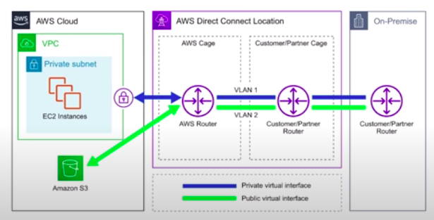
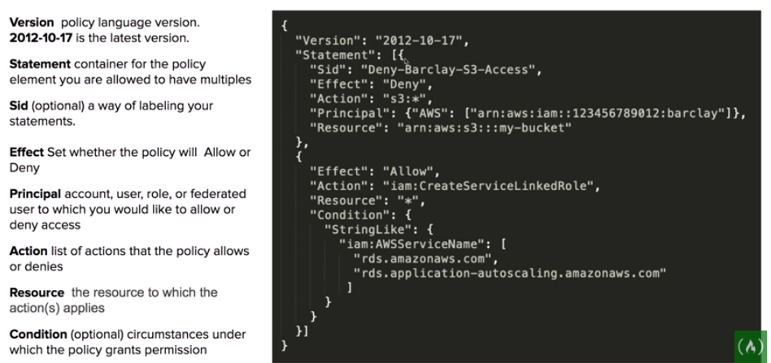

# AWS
- [S3](#s3)
- [VPC](#vpc)
- [IAM](#iam)
- [Cognito](#cognito)

# S3 
Simiple storage service, **Object**-based storage
- S3 replicates data across at least *3* AZ (availability zone)s to ensure 99.99%
availability.
- objects can be size from 0 *bytes* up to 5 terabytes
- access control is configured using *bucket policies* and *access control
  list* (ACL), which is a legacy method (not deprecated)

# VPC

## What is it?
Personal data center, gives you control over your virtual networking
environment


AWS has a default VPC in every region so you can immediately deploy instances, and it has the following defaults:
- has a size /16 IPv4 CIDR block (172.31.0.0/16)
- has a size /20 subnet in each az
- connected to IGW
- associated with a default NACL
- associated with default DHCP options
- has a main routing table

## Core components
- [Internet Gateway (IGW)](#internet-gateway)
- Virtual Private Gateway (VPN Gateway)
- [Route Table](#route-table)
- Network Access Control Lists (NACL) (Stateless)
- Security Groups (SG) (Stateful)
- Public Subnets
- Private Subnets
- Nat Gateway
- Customer Gateway
- VPC Endpoints
- [VPC Peering](#vpc-peering)

## Key Features
- vpcs are region specific, they do not span regions
- user can create up to 5 vpc per region
- every region comes with a default vpc
- 200 subnets/vpc
- can use IPv4 CIDR block in addition to IPv6 CIDR block (the address of the vpc)
- cost nothing to create: vpc, route tables, NACLs, IGW, SG, subnets, vpc peering
- cost money: NAT gateway, vpc endpoints, VPN gateway, customer gateway
- DNS hostnames (should your instance have domain name addresses)

### Internet Gateway
Allows VPC to access internet

It does two things:
1. provides a target in vpc route table for internet-routable traffic
    To route out to the internet, need to set destination to be 0.0.0.0/0
2. perform network address translation for instances that have assigned public IPv4 addresses (convert from private ip to public IP)

### VPC Peering
Allows user to connect one vpc with another over a **direct network route** using private IP addresses

no transitive peering (need to create direct connection between vpcs)

### Route table
Uses to direct network traffic
Each subnet in vpc must be associated with a route table
(one route table per subnet, but multiple subnets can use a same route table)

### Bastion
EC2 instances which are security harden. They are designed to help user to gain access to private EC2s via SSH or RCP

Also known as jumpbox

System Manager's Sessions Manager replaces the need for Bastions

### NAT Gateway
Intended for EC2s to gain outbound access to the internet for things such as security updates. (Cannot/should not be used as bastions)

### Direct connect
Solution for establishing dedicated network connections from on-premises locations to AWS.



### VPC Endpoints
A secret tunnel where you don't have to leave the aws network

Allow user to privately connect vpc to other aws services, and vpc endpoint services

- eliminates the need for an IGW, NAT, VPN connection, or AWS direct connect connections
- instances in the vpc do not require a public ip to communicate with service resources
- traffic between your vpc and other services does not leave the aws network
- 

two types of vpc endpoints:
1. interface endpoints
2. gateway endpoints

#### Interface Endpoints
not free
#### Gateway Endpoints
free


# IAM
Identity access management
## What is it?
A management system of *users* and *resources*

## Core components
- [IAM Policies](#iam-policies)
- [IAM Identities](#iam-identities)


### IAM Policies
JSON documents *attached to IAM identities* to grant premission for accessing services
- managed policies: managed by AWS, cannot be edited (labeled with organe box)
- customer managed policies: created by customers (reusable)
- inline policies: directly attached to the user (one-off, not reusable)



### IAM Identities
- IAM Users
- IAM Group
- IAM Roles

#### IAM Users
  End users who log into the console or interact with AWS resource programmatically

#### IAM Groups
  Group of IAM users that share permissions (admin, dev, auditors)

#### IAM Roles
  Associate permissions to a role and then assign this to users or groups or AWS resources. 
  e.g. 

  Can have multiple policies
  
  Q: Why have roles when you can attach (inline) policies to users and groups?
  
  A: See them as hats that you can put onto users/groups. e.g. Admin role with all permissions, guest role with read only permission, and etc.

### IAM Access Keys
Allow users to interact with AWS service programmatically via CLI or SDK
Two access keys per user

### IAM MFA
Multi-factor authentication can be turned on per user.
The user has to turn on MFA themselfs (because administrators have no access to users' physical device, but they can create policy to require MFA)

**\* Important note**: Lock your root user and use self defined (less privileged) users to perform tasks.

# Cognito
## What is it?
Decentralized managed authentication

- [Cognito user pools](#cognito-user-pools)
- [Cognito identity pools](#cognito-identity-pools)
- [Cognito sync](#cognito-sync)

Web Idenity Federation: to exchange identity and security information between an identity provider (IdP) and an application

Identity provider (IdP): a truster provider of your user identity that lets you use authentication to access other service
Example identity providers: fb, amazon, google, twitter

Types of IdP: OpenID connect (OIDC), SAML (for single sign on)

### Cognito user pools
user pools are user directories used to managed the action for web and mobile apps such as:
- sign up
- sign in
- account recovery
- account confirmation

### Coginito identity pools
Identity pools provide temporary AWS credentials to access AWS services

# AWS CLI

~/.aws/config
```
[default]
aws_access_key_id = <access key id>
aws_secret_access_key = <secret access key>
region = us-east-1
```
Command pattern

    $ aws SERVICE ACTION [--PARAM VALUE_OF_PARAM]

    e.g. 
    - $ aws iam create-user -user-name johndoe
    - $ aws s3 ls

Some flags to know
- --profile: used to switch between aws accounts
- --output: output format: json, table and text
